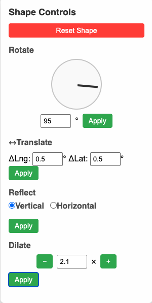

# uiDesignMaplarge
# Shape Controls UI

A minimal web UI for interactive geometric transforms (rotate, translate, reflect, dilate) on a map‑based shape. This demo replaces blocking prompts with intuitive, on‑screen controls.

---

## Live Demo Screenshot

---

## Features

- **Rotate**  
  - **Draggable dial**: grab and turn the knob to spin the shape ±180°.  
  - **Fine‑tune input**: type an exact angle in degrees and click **Apply**.  

- **Translate**  
  - Two numeric fields for **Longitude** and **Latitude** (in degrees).  
  - Click **Apply** to shift the shape east/west or north/south.  

- **Reflect**  
  - Choose **Vertical** or **Horizontal** axis via radio buttons.  
  - Click **Apply** to mirror across the bounding‑box center line.  

- **Dilate (Scale)**  
  - **–** and **+** buttons around a numeric input allow precise scaling without a slider.  
  - Enter or step the scale factor (e.g. 0.5× … 5×), then **Apply** to shrink or enlarge.  

- **Reset Shape**  
  - A single button to restore the original map boundary before any transforms.